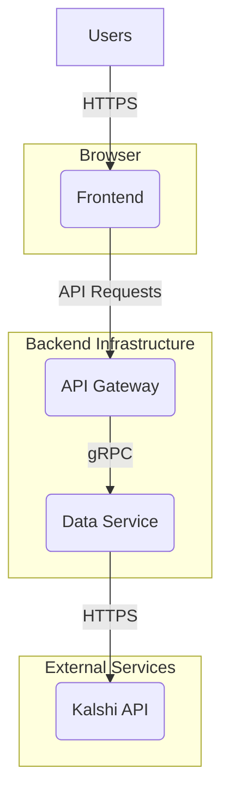

# Kalshi Analytics

This project provides a comprehensive platform for analyzing Kalshi event contracts. It combines a Python-based data service for fetching and analyzing data from the Kalshi API with a TypeScript and React-based frontend for data visualization and interaction.

## Architecture Overview

The project is structured into three main components: a frontend application, an API gateway, and a data service. This separation of concerns enhances modularity, scalability, and maintainability.

### Frontend

The frontend is a single-page application (SPA) built with React and TypeScript. It provides a user-friendly interface for visualizing market data, performing analysis, and managing user settings.

-   **Technology Stack:** React, TypeScript, Vite, Tailwind CSS
-   **Directory:** `frontend/`

### API Gateway

The API gateway serves as an intermediary between the frontend and the various backend services. It is responsible for routing requests, handling authentication, and aggregating data from different sources.

-   **Technology Stack:** Node.js, Express, TypeScript
-   **Directory:** `backend/api-gateway/`

### Data Service

The data service is a Python application responsible for all interactions with the Kalshi API. It fetches data, performs complex analytics, and exposes a gRPC interface for the API gateway to consume.

-   **Technology Stack:** Python, FastAPI, gRPC
-   **Directory:** `backend/data-service/`

## Getting Started

To get started with the project, please refer to the documentation in the `docs/` directory for detailed setup and usage instructions.